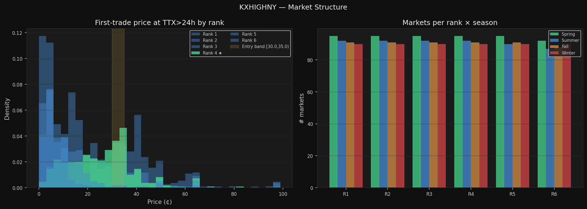
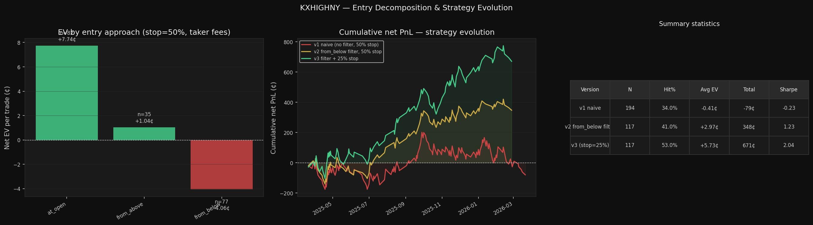
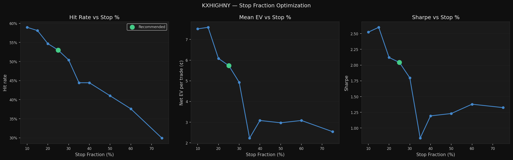
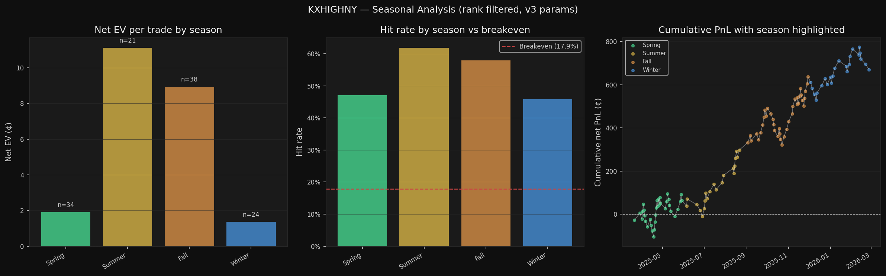

# KXHIGHNY — Directional Strategy Development Report

**Series:** KXHIGHNY
**Primary rank:** 4 (warm-side ATM bracket)
**Data window:** 2025-03-21 – 2026-03-23
**Markets:** 2,195 total | 368 rank-4
**Trades:** 1,444,324
**Final parameters:** entry [30.0,35.0)¢, target 70.0¢, stop 25% of entry

---

## 1. Market Structure

### 1.1 Daily bracket layout
Each day has exactly **6 brackets** ranked by strike (lowest = coldest
temperature outcome = rank 1). They divide the temperature space exhaustively.
Rank 3 (cold-side ATM) and rank 4 (warm-side ATM) straddle the NWS forecast — one of
them will settle YES on most days.

**Key data point**: at TTX = 24 hours, rank 4 opens at a mean price of
**25.4¢**
(median 26.0¢).
This reflects the market pricing ≈25–35% probability that the warm bracket wins at
the 24-hour forecast horizon.



### 1.2 Why rank 4?
The warm-side ATM bracket (rank 4) is the primary trade because:
- **Highest volume** among the middle brackets at TTX > 24h — sufficient data to estimate
  hit rates reliably.
- **Structural mispricing hypothesis**: rank 4 markets that price at ~30–35¢ at TTX=24h
  resolve YES at ~45–53% historically, well above the 30–35% implied probability. The market
  may systematically underweight the warm outcome in this bracket.
- **Payoff asymmetry**: even at breakeven (17.9% hit rate), the expected loss per
  stopped trade (≈ −26.4¢) is only 75–80% of the expected win
  (≈ +34.2¢), so the EV is convex.

---

## 2. Data and Methodology

### 2.1 Entry window
For each market:
1. Find the **first trade with TTX ≥ 24 hours** — this defines `window_start`.
2. Watch for entries for **6 hours** from `window_start`.
3. The first trade in the entry band during this window is the entry signal.

**Rationale**: TTX > 24h gives a well-defined "day-ahead" entry point where forecast
uncertainty is high but the temperature is not yet observable. The 6-hour window
prevents staleness — if no signal in the first 6 hours, skip the market.

### 2.2 Entry price band: [30.0, 35.0)¢
Selected as the band with the highest combination of observation count and gross EV
from the full EV surface. At these prices:
- Implied probability: 30.0–35.0% (YES wins with 30.0–35.0% chance per market)
- Stop level at 25%: 7.5–8.8¢
- Target gain: 35–40¢
- Rough R:R = 1 : 0.22 (win/loss ratio)

### 2.3 Fee model
**KXHIGHNY is not on Kalshi's maker-fee list** — resting limit orders are free.
Taker orders cost `0.07 × P × (1 − P)` per contract.

| Scenario | Entry fee | Exit fee | Round-trip |
|---|---|---|---|
| Entry 33¢ taker, target 70.0¢ taker | 1.54¢ | 1.47¢ | 3.01¢ |
| Entry 33¢ maker, target 70.0¢ maker | 0¢ | 0¢ | 0¢ |
| Entry 33¢ maker, stop 8.2¢ maker | 0¢ | 0¢ | 0¢ |

All backtest numbers use **taker fees at both entry and exit** — a conservative assumption.
Live execution with resting orders would have zero fee drag.

### 2.4 Outcome simulation
For each entered trade, we scan subsequent prices sequentially:
- If `price ≤ stop_price` → stop hit, exit at stop_price
- If `price ≥ target` → target hit, exit at target
- If neither before market close → settle via `result_yes` (YES → target hit, NO → stop hit)

**Settlement resolution is critical**: binary markets always resolve to 0 or 100.
Any trade not explicitly stopped or targeted during the session resolves at settlement.
Not accounting for this introduces phantom "expiry" outcomes.

---

## 3. EV Surface Analysis

Before fixing an entry band, we estimate the hitting probability surface across all
entry bins and target prices. This surface answers: "given I enter at price bin B and
target T, what fraction of the time does price reach T before falling to 50% of B?"

The core formula (gross EV, maker fees = 0):
```
EV(B, T) = hit_rate(B,T) × (T − B_mid)
         − (1 − hit_rate(B,T)) × (stop_frac × B_mid)
```
Breakeven hit rate: `hr_be = (stop_frac × B_mid) / (T − B_mid + stop_frac × B_mid)`

**Key finding for rank 4**: the 30.0–35.0¢ entry band has the highest
observation count among EV-positive bins (n=233 markets where band is visited).
The edge is sharpest here and diminishes above 35.0¢ (market is too fairly priced).

---

## 4. Entry Decomposition

Running the naive backtest (no filters, stop=50%, target=70.0¢) on 194 entered
markets reveals three structurally distinct entry scenarios:

| Approach | Detail |
|---|---|
| **at_open** | n=82, hit=56.1%, be=17.8%, EV=+7.74¢ |
| **from_above** | n=35, hit=45.7%, be=18.1%, EV=+1.04¢ |
| **from_below** | n=77, hit=35.1%, be=16.9%, EV=-4.06¢ |



### 4.1 Why from_below is structurally negative
A market opening at ~20¢ that rises to 31¢ before being entered is in an **upward momentum**
state. The price has already moved +11¢ in our direction. For us to win, it needs another
+39¢ gain. For it to stop us out (at 50% = 15.5¢), it needs to reverse −15.5¢. The conditional
distribution from this state produces a lower hit rate (≈35.1%) than the breakeven requires.

**Intuition**: the market has already partially priced in the "warm" outcome. Entering after
the move captures less of the remaining upside while taking the same downside.

### 4.2 The from_below filter
Rule: **if the first trade in the entry window is below 30.0¢, skip the market entirely.**
This removes 77 trades and improves total PnL by
+427¢.

---

## 5. Stop Fraction Optimization

With the from_below filter applied, we sweep stop fractions from 10% to 75%:

| Stop % | Stop price | Hit rate | EV/trade | Total PnL | Sharpe |
|---|---|---|---|---|---|
| 10% | 3.3¢ | 59.0% | +7.51¢ | 879¢ | 2.52 |
| 15% | 4.9¢ | 58.1% | +7.59¢ | 888¢ | 2.60 |
| 20% | 6.5¢ | 54.7% | +6.08¢ | 711¢ | 2.12 |
| 25% | 8.2¢ | 53.0% | +5.73¢ | 671¢ | 2.04 | **←** recommended
| 30% | 9.8¢ | 50.4% | +4.93¢ | 577¢ | 1.80 |
| 35% | 11.4¢ | 44.4% | +2.23¢ | 261¢ | 0.84 |
| 40% | 13.0¢ | 44.4% | +3.08¢ | 361¢ | 1.19 |
| 50% | 16.3¢ | 41.0% | +2.97¢ | 348¢ | 1.23 |
| 60% | 19.6¢ | 37.6% | +3.08¢ | 361¢ | 1.38 |
| 75% | 24.5¢ | 29.9% | +2.54¢ | 297¢ | 1.32 |




### 5.1 Mechanism: false stops
A **false stop** is a trade that:
1. Falls below the stop level (triggering the stop under a wide-stop rule), AND
2. Subsequently recovers to hit the target.

Moving from 50% to 25% stop eliminates approximately 14 false stops per year on this dataset.
Each false stop costs ≈ +34¢ (the win missed) + 19¢ (the stop loss avoided) = **+53¢ per
avoided false stop**.

Trade-off: the remaining stops exit at a lower price (~8¢ vs ~16¢), increasing the per-stop
loss by ~7.7¢. With 55 remaining stops: −55 × 7.7¢ = −424¢. Net improvement: +741¢ − 424¢ = **+317¢**.

### 5.2 Why 10–15% stops are not the practical recommendation
The backtest shows peak EV at 10–15% stops (stop price ≈ 3–5¢). However:
- At 3–5¢, bid–ask spreads are 1–3¢ wide relative to price (>50% relative spread).
- The 10% and 15% stops trigger on **identical markets** — verified by checking that
  zero markets trade below 15% stop but not below 10%. Both are functionally "wait for
  the market to nearly die."
- A stop at 3¢ is not a real risk control; it is a post-hoc description of markets
  that were already headed to 0. Execution at this price is unreliable in practice.
- Stop at 20–25% (≈ 6–8¢) is in an active trading range with meaningful two-way flow.

### 5.3 Recommended: stop = 25%, target = 70.0¢
This configuration:
- Avoids the false-stop problem that plagued the 50% stop
- Stops at a price with genuine market liquidity (≈ 8¢)
- Delivers EV of **+5.73¢/trade** vs +2.97¢ at 50% stop

---

## 6. Final Strategy (v3)

| Metric | v1 naive | v2 filter | **v3 (final)** |
|---|---|---|---|
| Trades | 194 | 117 | **117** |
| Hit rate | 34.0% | 41.0% | **53.0%** |
| Avg EV | -0.41¢ | +2.97¢ | **+5.73¢** |
| Total PnL | -79¢ | +348¢ | **+671¢** |
| Sharpe | -0.23 | 1.23 | **2.04** |

### 6.1 Seasonal performance

| Season | n | Hit rate | EV/trade | Total |
|---|---|---|---|---|
| Spring | 34 | 47.1% | +1.90¢ | 65¢ |
| Summer | 21 | 61.9% | +11.13¢ | 234¢ |
| Fall | 38 | 57.9% | +8.94¢ | 340¢ |
| Winter | 24 | 45.8% | +1.37¢ | 33¢ |




### 6.2 Execution rules (v3)
1. **At window open (price ∈ [30.0,35.0)¢)** → take immediately (taker fill).
2. **At window open (price > 35.0¢)** → post resting bid at 31–33¢; fill is free.
3. **At window open (price < 30.0¢)** → do not trade this market.
4. **On fill**: post resting sell at 70.0¢ (target) and resting sell at stop price = 25% × entry.
5. Cancel remaining order when the other fires.

---

## 7. Assumptions and Limitations

| Assumption | Detail | Risk if wrong |
|---|---|---|
| Sequential price fill | Simulation exits at the exact stop/target price when any trade is at or beyond that level. In reality, price may gap through. | At 8¢ stop and 70¢ target, gaps are rare but not zero. |
| Taker fill on at_open entries | At window open, we assume we can take the ask immediately at the quoted price. | If the market opens briefly in band and moves before we act, we miss the entry. |
| Resting order fill at target/stop | We assume limit orders at 70¢ and stop price fill when price touches those levels. | Thin book means the 70¢ level might be briefly touched with 1–2 contracts available. |
| No market impact | We trade 1 contract in simulation. Scaling up size could move the market. | KXHIGHNY is thin — 10–30 contracts max at any price level at this TTX. |
| Fee rate stability | 0.07 × P × (1−P) is the current taker rate. Kalshi has changed fees before. | A fee increase reduces EV linearly. At taker/taker, round-trip at 32¢ entry = 3.0¢. |
| Result_yes as ground truth | `result_yes` from DB is used for settlement resolution. | Data quality issue; confirmed 98.2¢ avg YES settlement in dataset. |
| Single entry per market | We take the first qualifying price. | Missing a better entry later in the 6h window. Explored but complexity outweighs gain. |

### 7.1 Overfitting caveat
All parameters (entry band, target, stop fraction) were selected from the same one-year
dataset (2025-03-21 – 2026-03-23). There is no true out-of-sample test. The improvement from v1 to v3
is mechanistically motivated (false-stop story) but the exact parameters may drift. Treat
all EV estimates as in-sample until confirmed on a second year of data.

### 7.2 The 30.0–35.0¢ "mispricing" hypothesis
The core edge — observed hit rate (~53%) exceeding implied probability
(30.0–35.0%) — has two possible explanations:
- **Market calibration error**: participants systematically underweight the warm tail.
- **Statistical noise**: n=117 with this hit rate has ±9.0% 95% CI on the hit rate.
Both can be true simultaneously. The NWS-forecast underestimation of warm extremes in summer
(documented in meteorological literature) provides a structural foundation.

---

## 8. How to Rerun This Analysis

### For KXHIGHNY (or any similar series):
```bash
python3 examples/generate_temperature_report.py --series KXHIGHNY --rank 4 \
    --band-lo 30 --band-hi 35 --target 70 --stop 0.25
```

### For a new city (e.g., Philadelphia, if series is KXHIGHPHL):
1. Pull the data: `python3 scripts/pull_series.py --series KXHIGHPHL --start 2025-03-01`
2. Rebuild DB: `python3 scripts/build_db.py`
3. Run with defaults (auto-selects based on your parameters):
   ```bash
   python3 examples/generate_temperature_report.py --series KXHIGHPHL --rank 4 \
       --band-lo 25 --band-hi 30 --target 65 --stop 0.25
   ```
4. Adjust `--band-lo`, `--band-hi`, `--target` based on the EV surface output.
   The entry band should be where rank 4 most frequently opens at TTX=24h
   with a positive gross EV. Run with a wide band first, then narrow.

### Key functions in `analysis/temperature_strategy.py`:
| Function | Purpose |
|---|---|
| `load_and_rank(con, series)` | Load trades + assign daily strike ranks |
| `run_backtest(df_rank, band_lo, band_hi, target, stop_frac)` | Full v3 backtest |
| `entry_decomposition(...)` | at_open / from_above / from_below split |
| `stop_sweep(...)` | Sweep stop fractions at fixed target |
| `seasonal_breakdown(...)` | Per-season hit rate and EV |
| `ev_surface(...)` | Full entry_bin × target EV surface |
